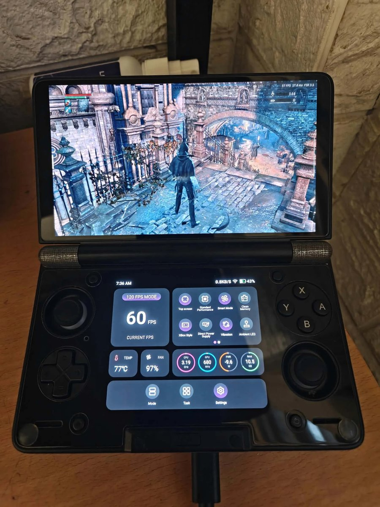
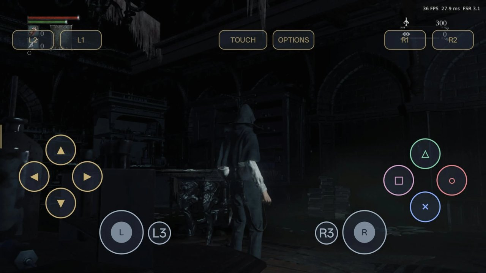

<h1 align="center">Bloodborne-Android</h1>

<p align="center">
  <b>Bloodborne on Android.</b> Yharnam on Snapdragon phones and handhelds.
</p>

<p align="center">
  <a href="https://github.com/ducvd89/Bloodborne-Android/releases/latest"></a>
  
  
  <a href="LICENSE"></a>
</p>

<table align="center">
  <tr>
    <td align="center" width="40%"><br><sub>AYN Thor · Snapdragon 8 Gen 2</sub></td>
    <td align="center" width="60%"><br><sub>Oppo Find N5 · Snapdragon 8 Elite · on-screen controller</sub></td>
  </tr>
</table>

Port of Bloodborne (PS4, **CUSA03173 v1.09**). The runtime and renderer run natively on ARM64, FEXCore translates the game's x86-64 code, and Mesa Turnip drives the GPU. Experimental.

## Features

- **FSR 3.1** upscaling and **FSR 3.1 frame generation**
- **On-screen PlayStation controller** with an editable layout; physical controllers work too
- **Two Vulkan drivers in one APK**, picked automatically for your GPU
- 16:9 picture on any screen, including foldables

## Devices

| Tested | SoC | GPU | Driver |
|---|---|---|---|
| AYN Thor | Snapdragon 8 Gen 2 | Adreno 740 | Mesa main |
| Oppo Find N5 | Snapdragon 8 Elite | Adreno 830 | Mesa turnip/gen8 |

Other Adreno 6xx/7xx/8xx devices are untested. Requires Android 9+ and 4 KB memory pages; tested with 16 GB RAM.

## Install

1. Download the APK from [Releases](https://github.com/ducvd89/Bloodborne-Android/releases/latest) and install it.
2. Copy your own extracted **CUSA03173 v1.09** dump to the phone.
3. Open the app, select the folder containing `eboot.bin`, and allow storage access. The first launch takes a few minutes.

The APK contains no game files. Updates keep settings and saves. The left-edge menu holds settings and the on-screen controller.

## Build

```bash
git clone --recursive https://github.com/ducvd89/Bloodborne-Android.git
cd Bloodborne-Android
bash tools/android/build_turnip.sh main
bash tools/android/build_turnip.sh gen8
bash tools/android/build_arm64.sh
python3 tools/android/build_arm64_bundle.py --device-libs <rootfs library list>
bash tools/android/build_release_apk.sh
```

Build inputs (SDK, rootfs, signing key, game icon) are listed in [docs/ANDROID_RELEASE_0_1.md](docs/ANDROID_RELEASE_0_1.md). The Linux PC build is documented in [README.linux.md](README.linux.md).

## Credits

[bloodborne_pc](https://github.com/deadinside28/bloodborne_pc) (Linux port), [shadPS4](https://github.com/shadps4-emu/shadPS4), [ARM_bloodborne_pc](https://github.com/MaSieS4Fun/ARM_bloodborne_pc), [FEX](https://github.com/FEX-Emu/FEX), [fexdroid](https://github.com/cobrabm12/fexdroid), [Mesa](https://gitlab.freedesktop.org/mesa/mesa), [mesa-unified turnip/gen8](https://github.com/whitebelyash/mesa-unified), [FSR-Vulkan](https://github.com/FireBurn/FSR-Vulkan).

Licensed under [GPL-2.0](LICENSE); third-party notices in [THIRD_PARTY_LICENSES.txt](tools/android/frontend/THIRD_PARTY_LICENSES.txt). Not affiliated with Sony Interactive Entertainment or FromSoftware.
